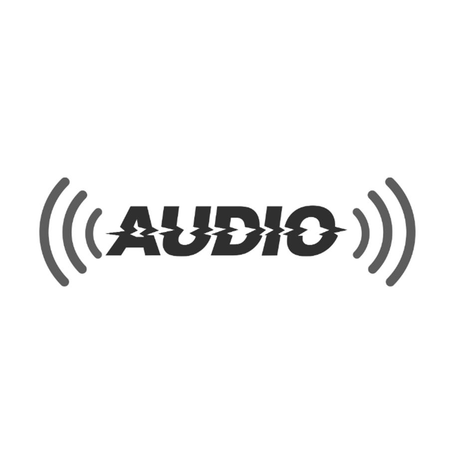

# Audio Examples

    Noisy:  
    <audio id="audioPlayerNoisy" controls>
        <source id="audioSourceNoisy" src="https://www2.informatik.uni-hamburg.de/sp/audio/publications/interspeech2024-ears/files/ears-wham/noisy/p102/00252_4.9dB.wav" type="audio/wav">
        Your browser does not support the audio element.
    </audio> 

    Conv-TasNet : 
    <audio id="audioPlayerConvTasNet" controls>
        <source id="audioSourceConvTasNet" src="https://www2.informatik.uni-hamburg.de/sp/audio/publications/interspeech2024-ears/files/ears-wham/convtasnet/p102/00252_4.9dB.wav" type="audio/wav">
        Your browser does not support the audio element.
    </audio> 

    CDiffuSE : 
    <audio id="audioPlayerCDiffuSE" controls>
        <source id="audioSourceCDiffuSE" src="https://www2.informatik.uni-hamburg.de/sp/audio/publications/interspeech2024-ears/files/ears-wham/cdiffuse/p102/00252_4.9dB.wav" type="audio/wav">
        Your browser does not support the audio element.
    </audio> 

    Demucs : 
    <audio id="audioPlayerDemucs" controls>
        <source id="audioSourceDemucs" src="https://www2.informatik.uni-hamburg.de/sp/audio/publications/interspeech2024-ears/files/ears-wham/demucs/p102/00252_4.9dB.wav" type="audio/wav">
        Your browser does not support the audio element.
    </audio> 

    SGMSE+ : 
    <audio id="audioPlayerSGMSE" controls>
        <source id="audioSourceSGMSE" src="https://www2.informatik.uni-hamburg.de/sp/audio/publications/interspeech2024-ears/files/ears-wham/sgmse/p102/00252_4.9dB.wav" type="audio/wav">
        Your browser does not support the audio element.
    </audio> 

    Clean:  
    <audio id="audioPlayerClean" controls>
        <source id="audioSourceClean" src="https://www2.informatik.uni-hamburg.de/sp/audio/publications/interspeech2024-ears/files/ears-wham/clean/p102/00252_4.9dB.wav" type="audio/wav">
        Your browser does not support the audio element.
    </audio>

[Link to another page](./another-page.html).

###### Header 6

| head1        | head two          | three |
|:-------------|:------------------|:------|
| ok           | good swedish fish | nice  |
| out of stock | good and plenty   | nice  |
| ok           | good `oreos`      | hmm   |
| ok           | good `zoute` drop | yumm  |

### There's a horizontal rule below this.

* * *

### Small image

### Definition lists can be used with HTML syntax.

<dl>
<dt>Name</dt>
<dd>Godzilla</dd>
<dt>Born</dt>
<dd>1952</dd>
<dt>Birthplace</dt>
<dd>Japan</dd>
<dt>Color</dt>
<dd>Green</dd>
</dl>
